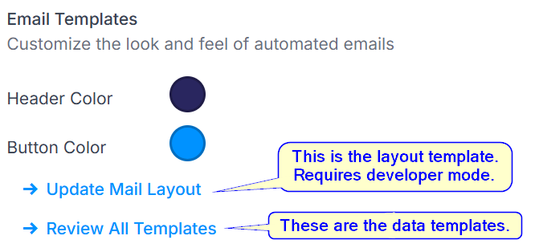
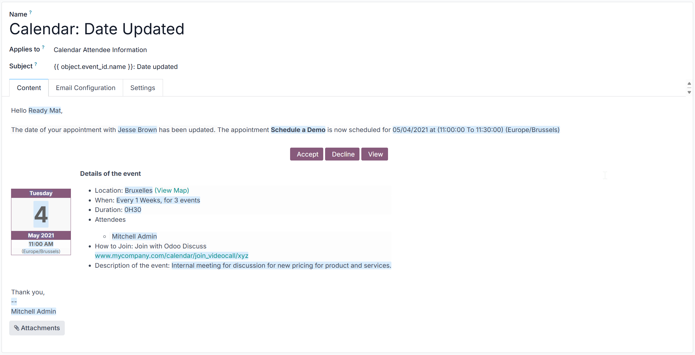
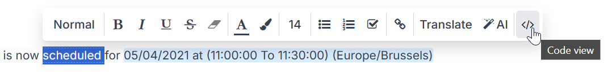

# GeoCat Email Templates for Odoo

This folder contains HTML email templates used by various Odoo modules.

**These templates are not part of the GeoCat Customization module!**  

They will not be deployed automatically,
but they need to be *manually* set in the Odoo Settings (search for `Email Templates`).  
The following sections explain how Odoo email templates work.

## Different kinds of email templates

In Odoo, 2 kinds of email templates exist:

### Email layout templates

These contain the "outer shell" of the email, with the header, footer, and general layout/styling.  
These are so-called QWeb `<template>` views (the same kind that are also used for the Odoo web UI), which should normally be overridden if customizations are required using `<xpath>` expressions.  
However, in the case of the email layout templates, this can be quite cumbersome and can lead to unexpected results, due to other module template overrides interfering (especially when `primary=True` has been set).

This is why we created our own **isolated** layout templates, which are installed by the GeoCat Customization module as a **full replacement** of the Odoo mail layout templates.
See `geocat/data/mail_templates_email_layouts.xml`. 

The `lib/utils.py` module provides some methods to **explicitly** map Odoo templates to GeoCat-branded alternative templates as follows:

| Odoo template name                                        | GeoCat template name                                 |
|-----------------------------------------------------------|------------------------------------------------------|
| mail.mail_notification_light                              | geocat.mail_layout_light                             |
| mail.mail_notification_layout                             | geocat.mail_layout_master                            |
| mail.mail_notification_invite                             | geocat.mail_layout_invite                            |
| mail.mail_notification_layout_with_responsible_signature  | geocat.mail_layout_master_with_responsible_signature |

:warning: As long as the GeoCat Customization module stays activated, the Odoo mail layout templates will **not be used**.  
However, please note that there are a couple of Odoo modules that send out emails that **do not make use of the layout templates**, 
but have dedicated email templates of their own, sometimes including both layout and body :scream:.  
These are stored in separate Qweb `<template>` views as well, and because they are not overridden by other Odoo modules, 
the GeoCat Customization module overrides them using the standard `<xpath>` technique. This applies to:

| Odoo template name                   | GeoCat template name           |
|--------------------------------------|--------------------------------|
| auth_signup.reset_password_email     | geocat.reset_password_email    |
| auth_signup.alert_login_new_device   | geocat.alert_login_new_device  |

:rotating_light: We do not override/replace **all** email templates. Some may remain untouched (e.g. `digest.digest_mail_layout`, because that is used internally only).
Newly activated modules should therefore always be checked for email templates that need to be overridden.

### Email data templates

These contain the content and placeholders for the actual **email body**.  
Some data templates however also contain layout information, which is a bit confusing, but we'll fix that (see next sections).

The data templates are stored in `<record>` objects, which are not (!) overridden by the GeoCat Customization module.
They often [cannot be (easily) overridden](https://numla.com/blog/odoo-development-18/modify-no-update-records-odoo-21) either, because most have the `noupdate="1"` attribute set.  

The `email_templates` folder you are currently in only contains the HTML (`body_html` field) for these _email data templates_, but not the other settings (like subject, recipient, etc.) stored in the other `<record>` fields (and thus the database).

### Template management in Odoo

Odoo modules usually define one or more **data** templates (as `<record>` in  `mail_template_data.xml`), which are then populated at runtime and wrapped in a **layout** template, before they are sent out.

In the Odoo settings, both can be configured manually as well, although you need administrative privileges, and for the layout templates,
you even need to enable the developer mode to see them:

Note that there are multiple layout templates for different purposes (see mapping table further above). 
However, only the "master" template is directly accessible in the Odoo settings when you click "Update Mail Layout").
The GeoCat Customization module should have changed that master from `mail.mail_notification_layout` to `geocat.mail_layout_master`.

If you wish to see the other templates, activate developer mode and go to `Settings` -> `Technical` -> `User Interface` -> `Views` and search for `mail_layout` (key).  
Note that these templates should **not** be edited directly (this rule applies to all Odoo templates).

:rotating_light: In order to avoid "duplicate" layout blocks, **all the layout stuff (headers, footers, etc.) has to be removed from the data templates** in the `Email Templates` records of Odoo!  
Please read the `How to override email data templates` section below for more information and instructions.

## Why do we do this?

We have a couple of good reasons why we want to override the email templates in Odoo:

1. The default Odoo email templates look like :shit:
2. They often contain information that we don't need or wish to hide, would like to rephrase or correct (typos...), or move to a different section.  
   For example, we do not want to show the total amount due on sale order emails.
3. Only the layout templates (views) respect the `Header` and `Button` color settings (linked to the active user company), 
   but many of the data templates (records) have "hard coded" Odoo branding (purple colors) in them... :unamused:
4. Most email templates contain a "Powered by Odoo" footer, which we don't want to see. We are paying Odoo customers after all.

As mentioned before, we can only override the layout templates, but a lot of data template records can't all be overridden (`<odoo noupdate="1">`), which means that we would have to [use a hack](https://numla.com/blog/odoo-development-18/modify-no-update-records-odoo-21) to get them replaced.  
For now however, we will have to manually update each record in the Odoo Settings (by pasting the HTML), which is a laborious activity. On the other hand, 
the alternative (defining record overrides in the GeoCat module for all Odoo modules that contain email templates) isn't an attractive solution either,
as you would first have to weed through all the `mail_template_data.xml` files in every installed Odoo module, and there are potentially over 50 of them.

## How to override email data templates

To override the email data templates, you need to be an administrator in Odoo and activate developer mode.
In the home menu (dashboard), type `Email Templates` for direct access, or go to `Settings` -> `Technical` -> `Email` -> `Email Templates`.

You should now see a list of all email data templates for each installed Odoo module.
Clicking on one of them will display the record properties, and show a WYSIWYG editor for the email body:

If you are in developer mode, you can select any text and then click the `</>` button to see the full HTML source code:

Now you can edit the HTML anyway you like. 

:warning: **Possible pitfalls**:

- Note that Odoo's mail preview might not always render correctly. 
  Always make sure that your HTML is okay by pressing the `Preview` button in the top left corner.
  If it still looks bad, try sending a test email to yourself or paste the HTML in a WYSIWYG code editor.
- Be careful with the placeholders in the HTML, as they are used by Odoo's Python code to insert the actual data.
  If you remove or rename a placeholder, the email might not be sent correctly.  
- Be careful with the CSS, as the email clients are very picky about what they support.
  You can use the [Campaign Monitor CSS guide](https://www.campaignmonitor.com/css/) to see what is supported where.
- When pasting HTML and saving it, Odoo performs some kind of sanitization, which might remove some of your code.  
  **Do NOT use self-closed tags**. Especially avoid `<t/>` tags, as the editor will rewrite them and add a `</t>` closing tag 
  somewhere at the end of the body, which likely breaks your template at runtime! Always write `<t></t>` tags instead, and if they are empty,
  the editor will properly rewrite them as `<t/>`. Also, **do not use ` ` or `
` tags**, but write ` ` and `
` instead.
- Be careful when using `
` tags, as the Odoo sanitization adds CSS styling to it, so that the spacing above and below is removed. 
  If you need an empty line between paragraphs, use `  ` instead.
- It is advised to keep the HTML editor open and iterate over all records (using the `<` and `>` buttons in the top right corner), saving each one after editing.

If you mess up, you can always revert to the original template by clicking the `Reset Template` button at the top and repeat the process.

**Note**:  
The HTML files in this folder are named according to the record `id`'s in the Odoo XML template files. 
These ID's are not visible in Odoo itself (record ID's are numeric in the database), but you can find the names of the XML 
template files that contain the original `<record>` objects in the `template_fs` field of the `mail_template` model 
in the database. Each `id` value of a `<record>` in the XML files corresponds to an HTML file name in this folder (i.e. `<id>.html`).

| Odoo name                                | File name                                          |
|------------------------------------------|----------------------------------------------------|
| Appointment: Appointment Booked          | appointment_booked_mail_template.html              |
| Appointment: Appointment Canceled        | appointment_canceled_mail_template.html            |
| Appointment: Attendee Invitation         | attendee_invitation_mail_template.html             |
| Payment: Payment Receipt                 | mail_template_data_payment_receipt.html            |
| Invoice: Sending                         | email_template_edi_invoice.html                    |
| Credit Note: Sending                     | email_template_edi_credit_note.html                |
| Calendar: Date Updated                   | calendar_template_meeting_changedate.html          |
| Calendar: Event Update                   | calendar_template_meeting_update.html              |
| Calendar: Meeting Invitation             | calendar_template_meeting_invitation.html          |
| Calendar: Reminder                       | calendar_template_meeting_reminder.html            |
| Helpdesk: Ticket Closed                  | solved_ticket_request_email_template.html          |
| Helpdesk: Ticket Received                | new_ticket_request_email_template.html             |
| Portal: User Invite                      | mail_template_data_portal_welcome.html             |
| Recruitment: Refuse                      | email_template_data_applicant_refuse.html          |
| Recruitment: Interest                    | email_template_data_applicant_interest.html        |
| Recruitment: Application Acknowledgement | email_template_data_applicant_congratulations.html |
| Recruitment: Not interested anymore      | email_template_data_applicant_not_interested.html  |
| Survey: Invite                           | mail_template_user_input_invite.html               |
| Sales: Order Cancellation                | mail_template_sale_cancellation.html               |
| Sales: Order Confirmation                | mail_template_sale_confirmation.html               |
| Sales: Payment Done                      | mail_template_sale_payment_executed.html           |
| Sales: Send Quotation                    | email_template_edi_sale.html                       |
| Settings: New Portal Signup              | set_password_email.html                            |
| Settings: New User Invite                | mail_template_user_signup_account_created.html     |
| Settings: Unregistered User Reminder     | mail_template_data_unregistered_users.html         |
| Subscription: Payment Failure            | email_payment_close.html                           |
| Subscription: Payment Reminder           | email_payment_reminder.html                        |
| Subscription: Rating Request             | mail_template_subscription_rating.html             |
| Subscription: Default Email Alert        | mail_template_subscription_alert.html              |
| Timesheets: Approver Reminder            | mail_template_timesheet_reminder.html              |
| Timesheets: Employee Reminder            | mail_template_timesheet_reminder_user.html         |

NOTE: Some module templates have not been customized yet (e.g. because they are internal only or not used). 
Among others, this applies to the following modules/templates:

- Gamification
- Survey: Certification Success
- SEPA Direct Debit / Payments
- Loyalty Coupon / Gift Card
- Planning
- Project